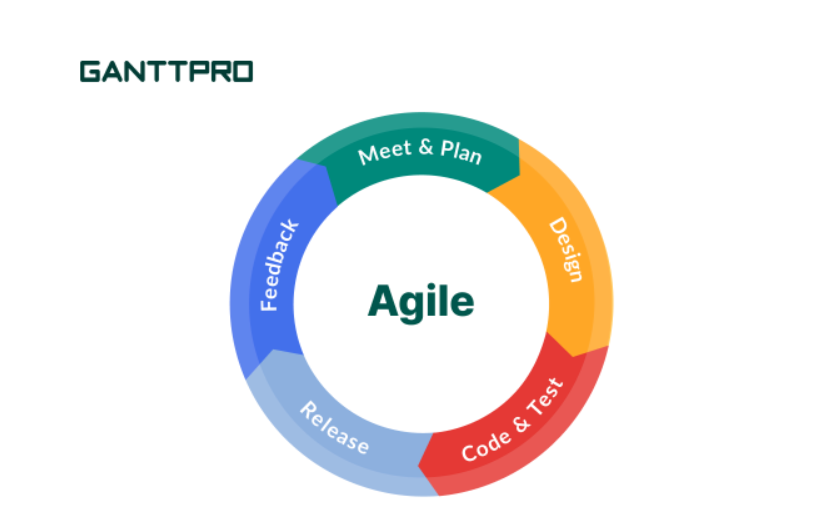

## Gaining Experience

Throughout my time in ICS 314, I have learned plethora of new concepts and skills that, not only apply to the assignments and work in class but, I believe will help a lot in my journey in becoming a software engineer. Out of all the computer science classes I have taken thus far, I truly believe that I have gained the most from ICS 314, both in improving the coding aspect of software engineering as well as understanding more of the concepts behind it. A big part of the growth I've made is learning and gaining experience with different development environments and common software engineering tools like Intellij and Github. I had no prior experience with these softwares and have found them to be very interesting and potentially useful in the future. This was made especially apparent to me when applying for internships recently, as a majority of them prefer applicants to have experience with things I was just introduced to in ICS 314 like Github.

## General Improvements

Although I improved on a multitude of specific software engineering aspects in ICS 314, I believe there have been multiple concepts that apply to software engineering as a whole and even beyond that. One of these concepts is coding standards because I learned how to really stick to set of guidelines and also double check them, especially during in-class workout of the days' as one mistake would lead to no credit. I believe it has been really good practice for the future in producing neat and readable code that is held to a specific standard. Another concept that applies generally to software engineering and beyond is agile project management, specifically issue driven project management. At first glance, it seems like a very simple and almost insignificant concept but I now believe that it can be essential to working as a team. Issue driven project management helped greatly in ensuring that my team was constantly making progress for our final project. Everyone could easily see what was being done, what needed to be done, and what has already been completed. This led to quicker and more productive discussions and well as little to no problems in terms of what to do moving forward. This experience with agile project management as well as working with a team will definitely benefit me greatly in the future as I strive to become a better software engineer.

## Looking Forward

Given the progress and knowledge of software engineering that I have recently gained, I am excited and motivated to build on it and grow even more as a software engineer. This past semester has really opened my eyes to the broad spectrum that software engineering has to offer and I'm really interested in diving deeper and finding the parts I love the most. I am definitely going to be utilizing the tools and skills provided to me by ICS 314 and only look improve on them in the near future. 
