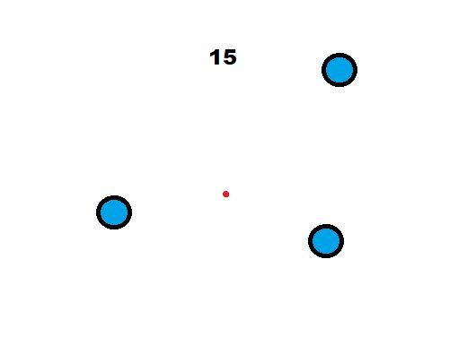

  

For my final project in ICS 111, I developed a dodging game in which you use your cursor to manuver a small dot around the screen in an attempt to avoid the larger dots moving and bouncing around. There was a score counter in the top center of the screen that continually went up the longer you survived while more dots were added in increments of 5 seconds. The game ended when you were hit by one of the larger dots and your final score was displayed along with the option to play again. 

For this project, I was the sole creator of the code and used Java along side a program called Processing which is essentially a software sketchbook that allowed for an easier creation of the GUI and interface that was utilized in the game. The actual code for this game was fairly difficult for me at first. I struggled heavily with making sure the balls would bounce at the moment they touched the edge of the screen as well as in the correct direction. Although it took a lot of work, I learned a lot from creating this project as it really tested my understanding of the concepts that I had learned throughout ICS 111, as well as incorporating slightly new concepts, in regards to code, such as velocity, angles, keyboard input, and the effect that they have in a visual aspect. 

You can learn more at the [Processing Website](https://processing.org/).

